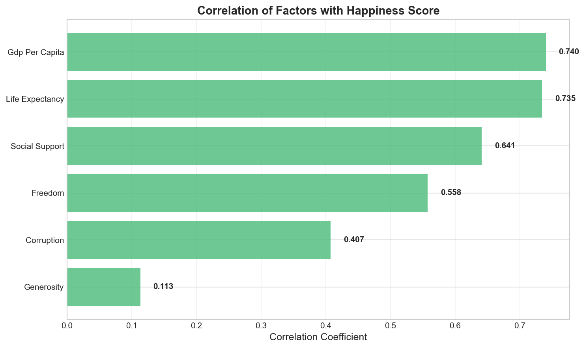
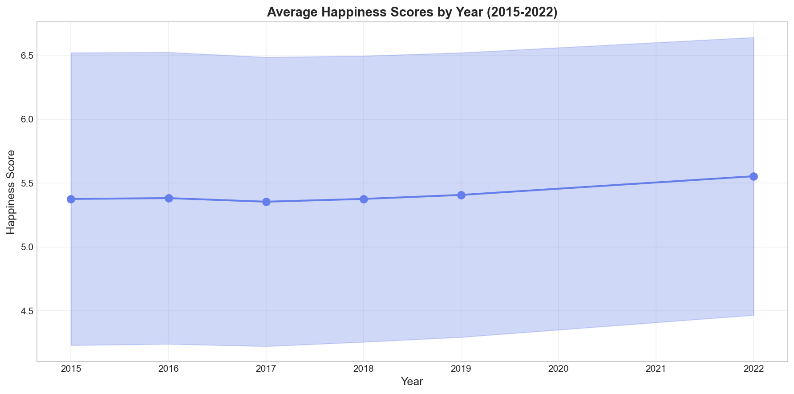
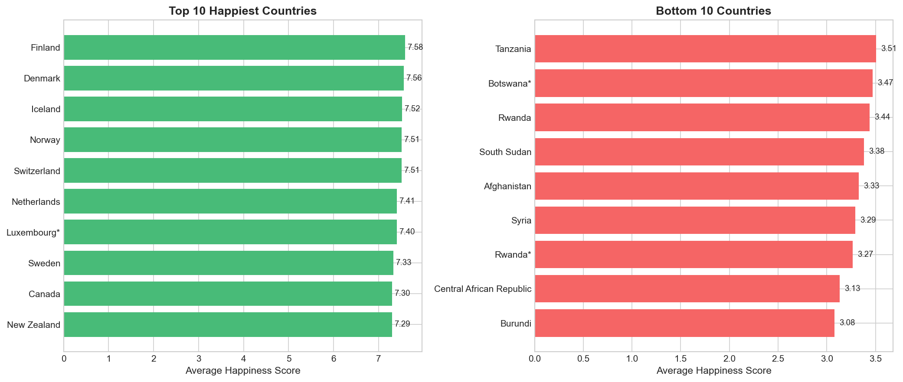
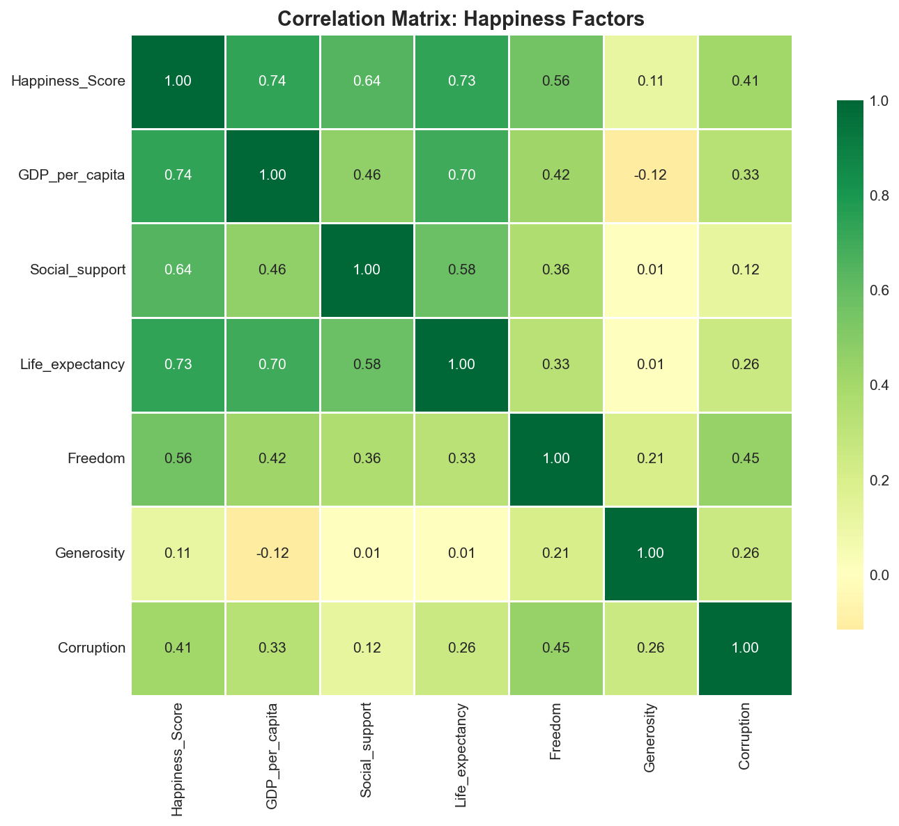

# World Happiness Report Analysis (2015-2022)

<div align="center">


[View Dashboard](https://public.tableau.com/app/profile/melis.atay6708/viz/HappinesTableu/WorldHappinessReport?publish=yes) • [Explore Notebook](./main.ipynb) • [Dataset](https://www.kaggle.com/datasets/mathurinache/world-happiness-report)

</div>

This project analyzed **8 years of global happiness data** from the World Happiness Report to understand what drives national well-being and how it has evolved over time.

Insights and recommendations are provided on the following key areas:
- **Happiness Drivers:** Which factors most strongly predict a country's happiness score?
- **Temporal Trends:** How has global happiness changed between 2015-2022?
- **Country Comparisons:** Which countries consistently rank highest/lowest, and why?

An interactive Tableau dashboard can be explored [here](https://public.tableau.com/app/profile/melis.atay6708/viz/HappinesTableu/WorldHappinessReport?publish=yes).

---

## Dashboard


The dashboard visualizes happiness scores across countries and time, featuring:
- **World Map** showing geographic distribution of happiness
- **Trend Analysis** tracking yearly changes
- **Factor Correlations** revealing key drivers
- **Country Rankings** for easy comparison

---

## Dataset Structure

The World Happiness Report dataset from Kaggle contains annual surveys (2015-2022) with varying schemas. After ETL processing:

| Column | Description |
|--------|-------------|
| `Country` | Country name (standardized) |
| `Year` | Survey year (2015-2022) |
| `Happiness_Score` | Overall happiness rating (0-10 scale) |
| `GDP_per_capita` | Economic prosperity indicator |
| `Social_support` | Having someone to count on |
| `Life_expectancy` | Healthy life expectancy |
| `Freedom` | Freedom to make life choices |
| `Generosity` | Charitable giving |
| `Corruption` | Perception of corruption |

---

## Insights Summary

### 1. GDP and Social Support are the Strongest Predictors



- **GDP per Capita (r=0.74)** and **Social Support (r=0.72)** show the highest correlation with happiness
- **Generosity (r=0.11)** has surprisingly weak correlation
- Economic factors matter, but social connections are equally important

### 2. Global Happiness is Slowly Increasing



- Average happiness rose from **5.38 (2015)** to **5.55 (2022)**
- 2017 saw the lowest average happiness score
- Despite COVID-19, 2022 recorded the highest average

### 3. Nordic Countries Consistently Lead



| Top 5 Countries | Avg Score | Bottom 5 Countries | Avg Score |
|-----------------|-----------|-------------------|-----------|
| Finland | 7.59 | Burundi | 3.08 |
| Denmark | 7.56 | Syria | 3.29 |
| Iceland | 7.52 | Afghanistan | 3.33 |
| Switzerland | 7.50 | Central African Rep. | 3.37 |
| Netherlands | 7.44 | Rwanda | 3.38 |

**Nordic success factors:** Strong social safety nets, high trust, work-life balance policies.

### 4. Correlation Matrix Reveals Key Relationships



---

## Recommendations

Based on the analysis, the following insights emerge:

1. **Invest in Social Infrastructure:** Social support shows nearly equal importance to GDP, suggesting community programs yield significant happiness returns.

2. **Focus Beyond Economic Growth:** While GDP matters, countries should prioritize life expectancy, freedom, and anti-corruption efforts for well-being.

3. **Learn from Nordic Model:** Top performers share strong social safety nets and work-life balance - policies worth emulating.

---

## Tech Stack

| Category | Technologies |
|----------|-------------|
| **Languages** | Python |
| **Libraries** | Pandas, NumPy, Matplotlib, Seaborn |
| **Tools** | Jupyter Notebook, Kaggle API, Tableau Public |
| **Techniques** | ETL, Data Imputation, Statistical Analysis |

---

## Data Pipeline

```mermaid

    A[Kaggle API] --> B[8 CSV Files]
    B --> C[Extract]
    C --> D[Transform & Standardize]
    D --> E[Handle Missing Values]
    E --> F[Unified Dataset]
    F --> G[EDA & Visualization]
```

---

## Project Structure

```
hapiness-portfolio-project/
├── main.ipynb                    # Analysis notebook
├── world_happiness_cleaned.csv   # Cleaned dataset
├── requirements.txt              # Dependencies
└── assets/                       # Visualizations
```

## Contact

**Melis Atay** • [LinkedIn](https://www.linkedin.com/in/melis-atay1/) • [GitHub](https://github.com/melisatayy)
