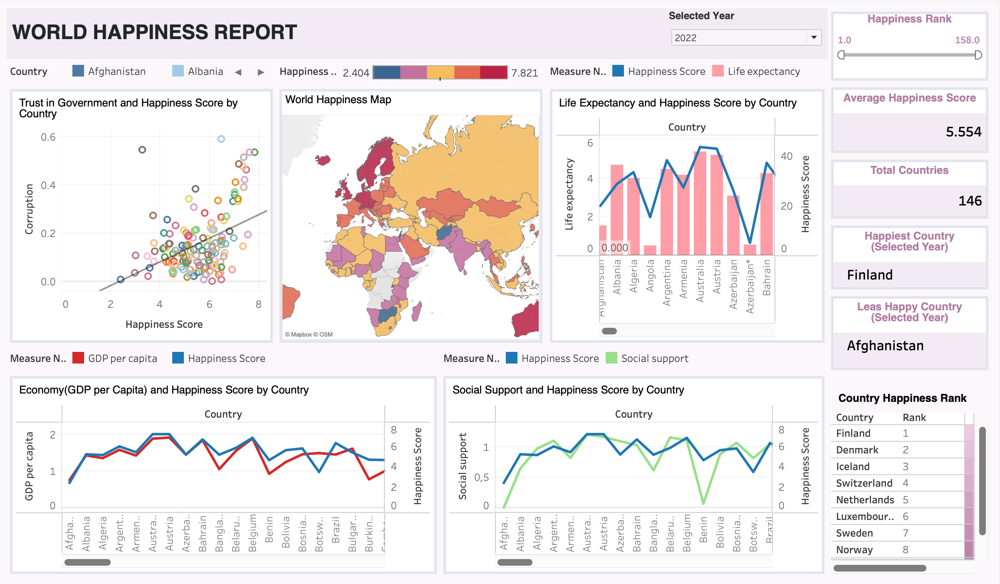

# Global Happiness Analysis: Multi-Year ETL Pipeline & Exploratory Data Study (2015-2022)

## Executive Summary

A data engineering and analytics project showcasing an end-to-end ETL pipeline built in Python, processing 8 years (2015–2022) of World Happiness Report data. The project creates a unified, analytics-ready dataset by standardizing inconsistent schemas and managing data quality across more than 144 countries.

Exploratory data analysis was performed to identify key happiness drivers and global well-being trends. The final dataset was imported into Tableau, where interactive dashboards and charts were developed to support country and time-based comparisons.

### Key Achievements

- Built robust ETL pipeline handling 8 different data schemas
- Implemented hierarchical missing data imputation strategy
- Identified GDP and social support as primary happiness drivers
- Visualized temporal trends and country-level comparisons

---

## Interactive Dashboard

### Tableau Public Dashboard

Explore the data interactively through a comprehensive Tableau dashboard featuring:

- **World Happiness Map** - Geographic visualization of happiness scores
- **Correlation Analysis** - GDP, Social Support, and Life Expectancy relationships
- **Temporal Trends** - Year-over-year happiness score changes by country
- **Country Rankings** - Top and bottom performers with detailed metrics



**🔗 [View Interactive Dashboard on Tableau Public](https://public.tableau.com/app/profile/melis.atay6708/viz/HappinesTableu/WorldHappinessReport?publish=yes)**

> **Note:** The dashboard allows filtering by year, country, and happiness factors for deeper exploration.

## Business Problem (Research Question)

### Problem Statement

> What really makes a country happy — and does it change over time?
Using multi-year global data, can we analyze how economic and social factors influence happiness and uncover meaningful patterns and comparisons across countries?

### Why This Matters

- **Happiness reflects real-life conditions**, such as health, income, freedom, and social support  
- **Inconsistent and fragmented data hides long-term trends**, making meaningful comparisons difficult  
- **Understanding what drives happiness** helps uncover global patterns and compare quality of life across countries  

---

## �️ Tech Stack

| Category | Tools |
|----------|-------|
| **Languages** | Python |
| **Libraries** | Pandas, NumPy, Matplotlib, Seaborn |
| **Tools** | Jupyter Notebook, Kaggle API, Tableau Public |
| **Techniques** | ETL, data imputation, statistical analysis, data visualization |

---

## Data Pipeline Architecture

```
Raw Data (Kaggle) → Extract (8 CSV files) → Transform (Standardize + Clean) → Load (Unified Dataset) → Analyze (EDA) → Visualize
```
---

##  Key Findings & Visualizations

- **Temporal Analysis:** Slight upward trend in global happiness (2015: 5.38 → 2022: 5.55)
- **Top Performers:** Finland (7.59), Denmark (7.56), Iceland (7.52)
- **Bottom Performers:** Burundi (3.08), Syria (3.29), Afghanistan (3.33)
- **Correlation Insights:** GDP per capita and social support show strongest positive correlation with happiness
- **COVID-19 Impact:** 2020-2021 data exhibited significant schema changes and reporting inconsistencies, reflecting the pandemic's disruption to global survey methodologies

